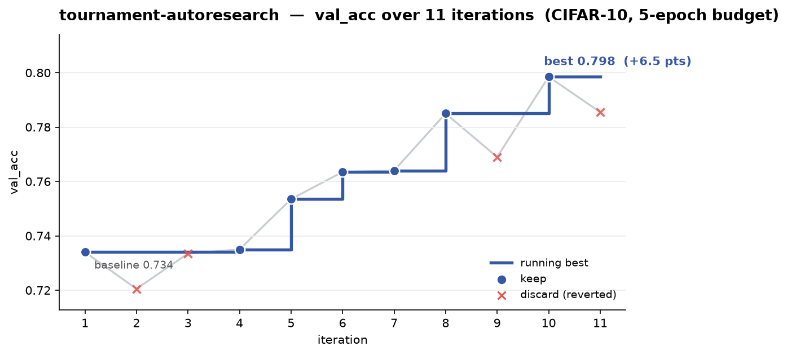
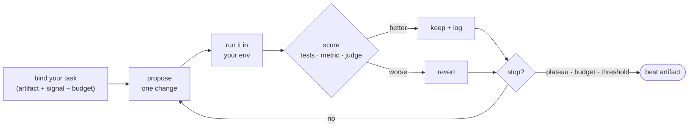

<div align="center">

# agent-loop-skills

### Loop until it's better — drop-in agentic **loops**, packaged as open-standard **Agent Skills**.

Autoresearch · scientific writing · data analysis · code/SQL/prompt optimization · red/blue/purple-teaming —
each a *generic, reusable loop* you bind to **your own task at invocation time**, that iterates
against a **real signal** until the work is actually better.

[](https://agentskills.io/specification)
[](#compatibility)

[](CONTRIBUTING.md)
[](LICENSE)
[](https://github.com/gaasher/agent-loop-skills)

<br/>

<!-- above-the-fold demo: a real run, not a mockup -->


<sub><b>A real run.</b> The <code>tournament-autoresearch</code> loop on a CIFAR-10 model under a fixed 5-epoch budget —
competing agents propose a change each step, a self-calibrating judge keeps the winners (green) and discards the regressions (gray):
<code>0.734 → 0.798</code> val_acc, hands-off, 7 of 11 kept. Full ledger: <a href="showcase/tournament-autoresearch/results.tsv">showcase/tournament-autoresearch</a>.<br/>
<i>Far from SOTA by design — a deliberately tiny CNN at 5 epochs on a laptop GPU (Apple MPS). The demo is the loop's decision-making, not the absolute accuracy.</i></sub>

</div>

---

## Why loops-as-skills

Two ideas collided in late 2025, and this repo lives in the overlap:

- **Skills became the portable unit.** An [Agent Skill](https://agentskills.io/specification) is just
  Markdown + a little YAML that an agent loads *only when relevant* — "maybe a bigger deal than MCP …
  throw in some text and let the model figure it out"
  ([Simon Willison](https://simonwillison.net/2025/Oct/16/claude-skills/)). One `SKILL.md` now runs across
  ~30 hosts (Claude Code, Codex, Cursor, …).
- **The loop became the program.** Karpathy ran [~700 autoresearch experiments in 2 days from one markdown
  prompt](https://www.nextbigfuture.com/2026/03/andrej-karpathy-on-code-agents-autoresearch-and-the-self-improvement-loopy-era-of-ai.html);
  Geoffrey Huntley's [Ralph](https://ghuntley.com/ralph/) is, "in its purest form, a Bash loop." Agents
  get most of their power not from one clever prompt but from **iterating against feedback**.

**This repo makes the loop *be* the skill.** Instead of task-specific skills, each entry is a generic loop —
*program · artifact · feedback signal · run ledger · termination* — that you bind to your task at invocation
time. Paste your goal; the loop proposes a change, runs it in **your** environment, scores it on a **real**
signal (tests, latency, a metric, a calibrated judge), keeps it only if it's better, logs it, and repeats.

> **The honest part:** unsupervised agent loops are famous for spinning forever and confidently shipping
> garbage — at 90% per-step accuracy, a 5-step chain fails ~40% of the time. Every loop here is
> **verification-gated**: an objective feedback signal decides each step and an explicit termination
> condition ends it. That discipline — not autonomy for its own sake — is the point. (See
> [Limitations](#status--limitations).)

## How a loop works



Every loop decomposes into the same five ingredients — **program** (`SKILL.md`), **artifact slot**
(what's improved), **feedback signal** (what drives the next step), **run ledger** (append-only log), and
**termination** (when to stop). Skills ship **zero heavy dependencies**: your code (a torch trainer, a SQL
database, a dataset) runs in *your* environment via a bound run command; the skill shells out and reads the
result. Multi-role loops use **spawn-or-degrade** — real isolated subagents on Claude Code, the same roles
inline elsewhere.

## Install

Any one of these installs all the loops:

**Claude Code — plugin marketplace** (add once, then install):
```
/plugin marketplace add gaasher/agent-loop-skills
/plugin install agent-loops@agent-loop-skills
```
Loops install namespaced as `agent-loops:<name>` (e.g. `agent-loops:karpathy`).

**Any Agent-Skills host — the standard installers:**
```bash
npx skills add gaasher/agent-loop-skills                   # auto-detects host, installs to the right dir
gh skill install gaasher/agent-loop-skills --agent <host>  # claude-code | codex | cursor | …  (--pin, gh skill update)
```

**Manual** — clone, then copy the loops into your host's skills dir (pick the line for your host):
```bash
git clone https://github.com/gaasher/agent-loop-skills

cp -r agent-loop-skills/loops/* ~/.agents/skills/   # cross-tool: Codex, Cursor, Pi, OpenClaw, …
cp -r agent-loop-skills/loops/* ~/.claude/skills/   # Claude Code
# Hermes: hermes skills tap add gaasher/agent-loop-skills
```

Then just describe your task — the host loads the matching loop. Research loops also call the shared
[`literature-search`](loops/literature-search) skill; installing everything puts it alongside them, and any
loop degrades gracefully (to WebSearch) if it's absent.

## Loops in action

Most skill repos tell you what a skill *is*. Here's what these loops actually *do* — real Sonnet runs,
full ledgers in [`showcase/`](showcase).

### 🧑‍⚖️ `tournament-autoresearch` — competing ideas, a self-calibrating judge
`<n>` agents pitch competing changes each step; a judge critiques them, picks one, runs it, and recalibrates
by comparing its *predicted* vs *realized* gain. On a CIFAR-10 SmallCNN under a fixed 5-epoch budget it
climbed **0.734 → 0.798 val_acc**, keeping 7 of 11 changes and **reverting all 4 that regressed** —
escaping the plateaus a single-thread loop gets stuck on. *(That's the run charted up top.)*
→ [`showcase/tournament-autoresearch`](showcase/tournament-autoresearch/results.tsv)

### 🔬 `ml-autoresearch` — analysis-first, every change traced to a cause
This loop reads *inside* each run — gradient flow, dead neurons, the loss curve — and grounds the next
change in that evidence rather than guessing: *"FC grad 57% vs first conv 3.3% — severe imbalance; 54% dead
neurons"* → add BatchNorm; *"cosine schedule fixed the epoch-3 dip entirely (monotonic!), +0.033"*. It also
**reverts** what hurts (augmentation, over-aggressive LR). The point isn't a leaderboard number — it's that
every accepted change has a measured reason behind it. → [`showcase/ml-autoresearch`](showcase/ml-autoresearch/results.tsv)

### 📊 `data-analysis` — findings with a number behind every one
Hypothesis → verify, stdlib-only. On a planted dataset it surfaced **3 real findings and correctly refuted 2**,
with effect sizes matching ground truth and **no hallucinations**: *enterprise vs consumer order value
184.90 vs 109.16 (Cohen's d = 2.13)*, *mobile return rate 32.8% vs 8.2% (RR 4.0)* — and it **reversed** a
plausible-but-wrong claim once it spotted a mobile confound. → [`showcase/data-analysis`](showcase/data-analysis)

<details>
<summary><b>More real runs</b> — optimize-loop, research-proposal, red-team, power-analysis…</summary>

| Loop | What the run did |
|---|---|
| [`optimize-loop`](showcase/optimize-loop) | Correctness-gated speedup: a SQLite query **1,131.75 ms → 1.055 ms (~1,073×)**, result-set hash matching baseline on **every kept iteration**; in *code* mode cut cyclomatic complexity **23 → 15** (nesting 7 → 3) with **13/13 tests green**. |
| [`research-proposal`](showcase/research-proposal) | ScholarEval graded a proposal against the literature; Judge + Reviser iterated **grade 45 → 84** (soundness 2→4, contribution 1→4) over 5 rounds. |
| [`scientific-figure`](showcase/scientific-figure) | Same ImageNet top-1-accuracy bar-chart brief, with vs without the loop: a single call truncated the y-axis at 50% and used non-paper numbers; the loop verified every value against the arXiv papers, flagged GoogLeNet's borrowed top-1, and iterated **80 → 96 (PASS)**. |
| [`red-team`](showcase/red-team) | Against a naive content filter, surfaced **all 5 planted weaknesses** (case bypass, leetspeak, spacing, synonyms, over-block) — 39 bypasses + 6 over-blocks — with a one-line root-cause fix each. |
| [`power-analysis`](showcase/power-analysis) | Solved **n = 100/group for 80% power** via Monte-Carlo, fixed all 6 validity flaws, and emitted a full pre-registration. |
| [`research-question`](loops/research-question) | Sharpened 5 vague drafts → 3 strong questions (≥75), with real web novelty checks pivoting already-answered questions toward the open sub-problem. |

</details>

## The loops

`†` = **multi-role** (real subagents on Claude Code, inline elsewhere). Browse any folder for its `SKILL.md`.

<details open>
<summary><b>Autoresearch</b> — iterate on an ML artifact against a metric</summary>

| Loop | Why you'd reach for it |
|---|---|
| [`karpathy`](loops/karpathy) | The minimal baseline — propose, train, keep-if-better, loop. A faithful nod to Karpathy's autoresearch. |
| [`ml-autoresearch`](loops/ml-autoresearch) † | Analysis-first: diagnoses each run and grounds the next change in evidence. A `literature` dial adds paper-grounded changes. |
| [`exploratory-autoresearch`](loops/exploratory-autoresearch) | Forces broad exploration via a temperature/swing scheduler — escapes hill-climbing one idea forever. |
| [`tournament-autoresearch`](loops/tournament-autoresearch) † | Competing changes judged each step by a self-calibrating judge. |
| [`dueling-autoresearch`](loops/dueling-autoresearch) † | Two approaches race the same metric in parallel and borrow ideas across lanes. |
| [`alpha-evolve`](loops/alpha-evolve) † | Population-based evolution (MAP-Elites + islands, diff-mutate, cascade-eval). |

</details>

<details>
<summary><b>Literature & writing</b> · <b>Data</b> · <b>Code & optimization</b> · <b>Security</b> · <b>Other</b> (click to expand)</summary>

**Literature & writing**

| Loop | Why you'd reach for it |
|---|---|
| [`literature-search`](loops/literature-search) | Shared toolchain (not a loop): paper discovery, snippets, citation-graph, full-text over Semantic Scholar + arXiv. |
| [`literature-survey`](loops/literature-survey) | Builds a saturating evidence/contradiction matrix of sources × claims. |
| [`research-question`](loops/research-question) | Sharpens a vague topic into strong, novel, feasible research questions. |
| [`hypothesis-gen`](loops/hypothesis-gen) † | Generates and literature-vets a pool of research hypotheses. |
| [`research-proposal`](loops/research-proposal) † | Grades a proposal against the literature (ScholarEval) and revises until it passes. |
| [`scientific-writer`](loops/scientific-writer) † | Specialist judges + an independent peer-reviewer critique a draft; a writer revises until the score clears a bar. |
| [`scientific-figure`](loops/scientific-figure) † | A generator drafts a publication figure from your data/brief; an adversarial critic grades it against a fixed rubric — both can consult the literature (S2/arXiv) — and the two iterate until it's paper-ready. |

**Data**

| Loop | Why you'd reach for it |
|---|---|
| [`data-analysis`](loops/data-analysis) | Hypothesis → verify discovery; every finding backed by a reproduced number at a meaningful effect size. |
| [`anomaly-investigation`](loops/anomaly-investigation) | Diagnoses the cause of a known anomaly by forming, testing, and eliminating candidates. |
| [`claim-verify`](loops/claim-verify) | Adversarially verifies a results draft's claims against the underlying data. |
| [`tabular-cleanup`](loops/tabular-cleanup) | Cleans a messy table to an inferred data contract with deterministic checks. |

**Code & optimization**

| Loop | Why you'd reach for it |
|---|---|
| [`optimize-loop`](loops/optimize-loop) | Evaluator-optimizer with a pluggable correctness gate + minimized metric — refactor code (tests green + complexity↓) or speed up SQL (identical results + latency↓). |
| [`prompt-optimize`](loops/prompt-optimize) | Evolves a prompt against a user-supplied scoring command (a black-box oracle). |

**Security** — authorized testing only

| Loop | Why you'd reach for it |
|---|---|
| [`red-team`](loops/red-team) | Adversarial loop-until-dry that surfaces distinct failure classes of a system you own. |
| [`blue-team`](loops/blue-team) | The defensive fixer — closes a failure catalogue's classes under a regression gate, then opens a PR. |
| [`purple-team`](loops/purple-team) † | Orchestrates red → blue → re-verify until a fresh attack pass stays dry; opens a PR with the patch set. |

**Other**

| Loop | Why you'd reach for it |
|---|---|
| [`power-analysis`](loops/power-analysis) | Sizes and pre-registers a two-arm experiment to hit a target statistical power. |

</details>

## Compatibility

Skills (a `SKILL.md` the model invokes) work **broadly** across the open standard. A loop **dispatching a
subagent from a role file at runtime** is confirmed only on Claude Code — elsewhere multi-role loops (`†`)
run their roles **inline** (still correct, just serial). Single-agent loops run fully everywhere.

| Host | Skills | Loop-dispatched subagents |
|---|:--:|---|
| **Claude Code** | ✅ | ✅ real, isolated, parallel — **verified** |
| Claude Agent SDK | ✅ | ✅ |
| Codex CLI · Cursor | ✅ | ➖ inline |
| Hermes · Antigravity · Pi · OpenClaw | ✅ *(reported)* | ➖ inline |

Full, citation-backed matrix and the precise "why subagents are Claude-Code-only" reasoning:
[`docs/compatibility.md`](docs/compatibility.md). **Off Claude Code, don't rely on parallel subagent isolation.**

## Compose with other skill collections

These are self-contained, open-standard skills, so they coexist with any other collection — install both into
the same skills dir and use them together. For example alongside
[K-Dense `scientific-agent-skills`](https://github.com/K-Dense-AI/scientific-agent-skills):

```bash
npx skills add gaasher/agent-loop-skills              # these loops
npx skills add K-Dense-AI/scientific-agent-skills     # + a domain-skill library
```
They install as sibling folders (Claude Code namespaces each plugin; other hosts load all and pick by
`description`). A loop's analysis step can invoke any other installed skill — the same mechanism the research
loops use to call `literature-search`.

## Roadmap

Loops are most useful when they're honest about what's next. PRs on any of these are very welcome:

- [x] **Blue-teaming + communication interface** — shipped as [`blue-team`](loops/blue-team) (the
  defensive fixer) and [`purple-team`](loops/purple-team) (find → fix → re-verify), with the pull
  request as the communication interface to the target's owner.
- [ ] **Per-loop `sandbox/` eval cases** committed for every loop, so anyone can reproduce a run end-to-end.
- [ ] **Host-specific subagent adapters** (Cursor subagents, Hermes `delegate_task`) so multi-role loops get
  real isolation beyond Claude Code.
- [ ] **More domains** — eval-harness optimization, refactoring-at-scale, agent-trace debugging.

See [open issues](https://github.com/gaasher/agent-loop-skills/issues) and grab a
[`good first issue`](https://github.com/gaasher/agent-loop-skills/labels/good%20first%20issue).

## Status & limitations


**Experimental — expect breaking changes.** Pin a version if you need stability.

- **Non-deterministic.** Treat every output as a *draft to verify*, not a result to trust. *Workaround:* seed where supported; verify against your own oracle.
- **No correctness guarantee.** A loop can be confidently wrong. *Workaround:* every loop gates on a signal — keep a human in the loop and point it at checks you own.
- **Host-dependent.** Real subagent isolation is verified only on Claude Code. *Workaround:* see [Compatibility](#compatibility).
- **Cost & latency.** Loops make many model calls. *Workaround:* start with a low iteration budget.

**Non-goals** (deliberate scope, not missing features): these are **human-supervised loops**, not
fully-autonomous agents; **not a model or runtime** (bring your own host); **not domain-exhaustive** — for a
very custom workflow, fork a loop, that's what they're for.

## Contributing — and a note on open source 💜

I love open source, and this repo is built to be added to. **You don't need to be an expert and you don't
need to write code** — a sharper `description`, a new loop, a bug report, or a pasted run transcript all make
it better. New loops are welcome, and so are wild ideas.

Start with **[CONTRIBUTING.md](CONTRIBUTING.md)** and the authoring rubric in
[`docs/skill-authoring-rules.md`](docs/skill-authoring-rules.md); grab a
[`good first issue`](https://github.com/gaasher/agent-loop-skills/labels/good%20first%20issue). Be kind, have
fun, and if a loop helped you, a ⭐ genuinely helps others find it.

## Provenance / credits

- [`karpathy`](loops/karpathy) — a faithful adaptation of Andrej Karpathy's autoresearch program-as-skill idea.
- [`alpha-evolve`](loops/alpha-evolve) — a simplified, ML-bent re-creation of **AlphaEvolve**
  (Novikov et al., 2025, [arXiv:2506.13131](https://arxiv.org/abs/2506.13131)) +
  [OpenEvolve](https://github.com/algorithmicsuperintelligence/openevolve).
- [`research-proposal`](loops/research-proposal) — its ScholarEval evaluator faithfully reimplements
  **ScholarEval** ([arXiv:2510.16234](https://arxiv.org/abs/2510.16234)).
- Layout and the dependency-isolation philosophy are informed by
  [K-Dense `scientific-agent-skills`](https://github.com/K-Dense-AI/scientific-agent-skills).

## Repo layout

```
agent-loop-skills/
├── loops/            # one self-contained, installable skill per folder (SKILL.md + tools/roles/schemas/rubrics/examples)
├── showcase/         # real archived runs (ledgers + results) behind the examples above
├── assets/           # generated progress charts
├── docs/             # authoring rules, compatibility, api-keys, authoring quickstart
└── .claude-plugin/   # plugin.json + marketplace.json (Claude Code plugin / marketplace)
```

<div align="center">

### ⭐ If looping until it's better is your kind of fun, star it and [send a loop](CONTRIBUTING.md).

<a href="https://star-history.com/#gaasher/agent-loop-skills&Date">
  
</a>

</div>
