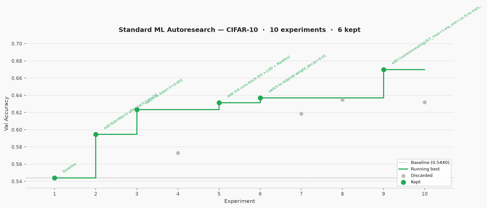

# standardMLAutoresearch

**A mono-agent ML research loop driven by analysis, not guesswork.**

Unlike [`karpathy`](../karpathy), which proposes changes and scores them blindly,
this loop treats every training run as an experiment to be *understood*. After each
run the agent performs a diagnostic pass — examining gradients, activations,
embeddings, error patterns, training dynamics, or whatever the results suggest —
then uses those findings to motivate the next change. Changes are hypotheses grounded
in evidence.

## What makes it different from karpathy

- **Analysis phase after every run** (step 6 of the loop). The agent chooses what
  to examine based on what the results suggest — not a fixed checklist. Findings are
  written to `iter<N>/analysis/`.
- **Hypothesis must cite the analysis** before any change is applied. No blind tries.
- **`results.tsv` has an `analysis_summary` column** — each row records the key
  finding that motivated the change.
- **Instrumentation is a valid iteration**: if the analysis reveals a useful quantity
  that isn't being logged, adding it counts as a loop step.

## Per-iteration sandbox layout

```
<sandbox_root>/
├── schema.yaml
├── results.tsv
└── iter<N>/
    ├── schema.yaml          # copy of root schema
    ├── code_snapshot/       # editable files before this iteration
    ├── run.log              # full training output
    ├── analysis/            # scripts written and run during the analysis phase
    └── results/             # outputs produced by analysis scripts
```

## Example run (CIFAR-10 testbed)

10 experiments, 6 kept improvements. Baseline SmallCNN + SGD → 3-block BN-CNN + AdamW + cosine LR: **0.544 → 0.670 val_acc**.

Every change in this run was grounded in prior analysis — BatchNorm was chosen because
the first conv layer received only 3.3% of the gradient signal; the cosine schedule
was chosen because a consistent epoch-3 val_acc dip pointed to large mid-training LR
updates destabilising learned representations.



## Files

| File | Role |
| --- | --- |
| `SKILL.md` | The full loop program. |
| `schema.example.yaml` | Copy to `schema.yaml` and fill in, or answer interactively. |
